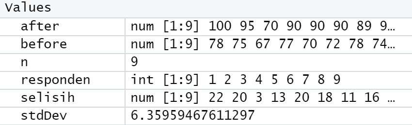
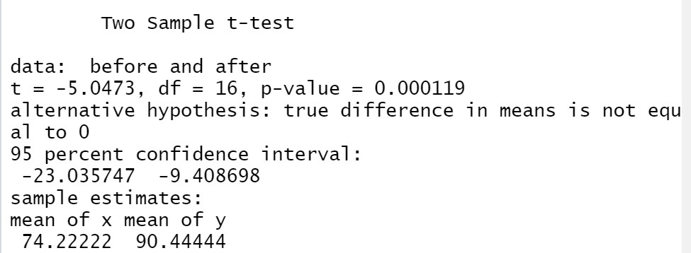
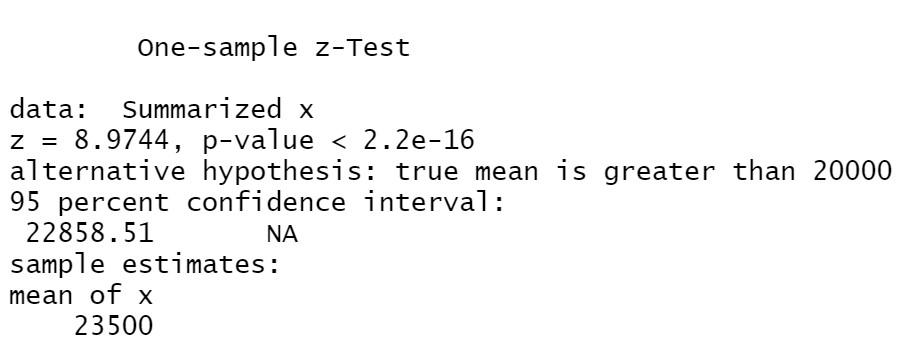
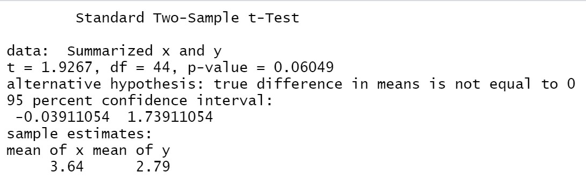
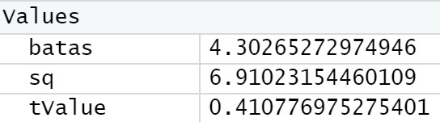

# P2_Probstat_D_5025201188


---

## Tabel Konten
- [Soal 1](#nomor-1)  
- [Soal 2](#nomor-2)
- [Soal 3](#nomor-3)

---
**[Source Code](https://github.com/Graidy27/P2_Probstat_D_5025201188/blob/main/D_5025201188.R)*

## Nomor 1
Foto hasil:


### a
```
before <- c(78, 75, 67, 77, 70, 72, 78, 74, 77)
after <- c(100, 95, 70, 90, 90, 90, 89, 90, 100)

responden = c(seq(1:9))
data = data.frame(responden, before, after)
n = 9

selisih = data$after - data$before
cat("Standar Deviasi dari data selisih pasangan pengamatan tabel = ")
stdDev = sd(selisih)
stdDev
```
- Menyimpan hasil sebelum kegiatan ke dalam `before` dan setelah kegiatan kedalam `after`
- Menyimpan hasil selisih `after` - `before` ke dalam selisih
- Mencari standar deviasi selisih menggunakan fungsi `sd` dan menyimpannya ke dalam variabel `stdDev`

### b
Foto hasil:


```
var.test(before, after)
t.test(
       before, 
       after, 
       mu = 0, 
       alternative = "two.sided", 
       var.equal = TRUE,
       conf.level = 0.95
)
```
- Menggunakan fungsi seperti yang terdapat di dalam modul, yaitu `t.test`

### c
H0 : “tidak ada pengaruh yang signifikan secara statistika dalam hal kadar saturasi oksigen, sebelum dan sesudah melakukan aktivitas A”. Karena nilai p (p-value) sangat kecil atau mendekati 0, maka H0 ditolak. Sehingga, dapat disimpulkan "terdapat pengaruh yang signifikan secara statistika dalam hal kadar saturasi oksigen, sebelum dan sesudah melakukan aktivitas A"


## Nomor 2
Foto hasil:


```
zsum.test(
      mean.x = 23500, 
      sigma.x = 3900, 
      n.x = 100,
      alternative = "greater", 
      mu = 20000,
      conf.level = 0.95
)
```
- Menggunakan fungsi seperti yang terdapat di dalam modul, yaitu `zsum.test`
### a
Setuju. Karena hasil dari uji Z menolak H0. Sehingga, dapat dipastikan bahwa mobil dikemudikan lebih dari 20.000km per tahun.

### b
Nilai dari z nya adalh 8.9744 dengan p-value < 2.2e-16. Selain itu, dari output di atas, kita juga peroleh selang kepercayaan rata-rata dari sampel yang berkisar di antara 22858.11 dan tak terhingga atau dapat dinyatakan bahwa dengan selang kepercayaan 95% kita yakin rata-rata weight akan lebih dariara 22858.11. Rata-rata weight dari data sampel yang dihitung adalah 23500.

### c
Berdasarkan nilai p yang mendekati 0 (sangat kecil), maka nilai H0 dapat ditolak sehingga dapat disimpulkan mobil dikemudikan rata rata lebih dari 20.000 km per-tahun.

## Nomor 3
### a
- H0 = "Rata - rata saham di kota Bandung sama dengan rata rata saham di kota Bali"
- H1 = "Rata - rata saham di kota Bandung tidak sama dengan rata rata saham di kota Bali"

### b
Foto hasil:

```
tsum.test(
      mean.x=3.64, s.x = 1.67, n.x = 19, 
      mean.y=2.79, s.y = 1.32, n.y = 27, 
      alternative = "two.sided", mu = 0, var.equal = TRUE,
      conf.level = 0.95
)
```
- Menggunakan fungsi seperti yang terdapat di dalam modul, yaitu `tsum.test`

### c
Foto hasil untuk soal c-f:

- Menjalankan program `batas = qt(p = 0.025, df = 2, lower.tail = FALSE)` untuk mendapatkan batas.

### d
- Menghitung secara manual dan menyimpan nilai t-value ke dalam variabel tValue

### e
Menolak H0 jika tValue > batas atau tValue < -batas

### f
Karena nilai tValue berada diantara batas, maka H0 diterima
H0: "Rata - rata saham di kota Bandung sama dengan rata rata saham di kota Bali"
